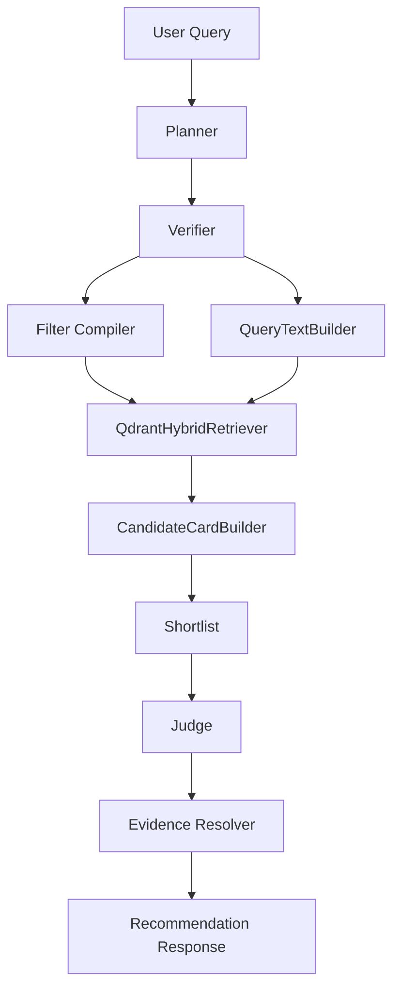

# Service Flow

This document describes the current recommendation pipeline behavior.

## Overview

## 1. Query Normalization

API normalizes the incoming query with whitespace collapse only.

- no regex extraction
- no hardcoded synonym replacement
- no keyword stripping

The normalized query is passed into planner and kept in trace as `raw_query`.

## 2. Planner

Planner receives:

- normalized query
- request filter overrides
- include and exclude organization constraints
- requested `top_k`

Planner behavior:

- uses deterministic request parameters
- attaches a deterministic seed derived from request payload and attempt index
- returns JSON only
- separates retrieval terms into `core_keywords`
- separates non-retrieval request terms into `task_terms`
- stores planner raw output in `planner_trace`

## 3. Verifier

A second LLM call verifies the planner output before retrieval.

Verifier behavior:

- receives normalized query plus planner JSON
- rewrites planner output into the same schema
- keeps only retrieval-safe domain terms in `core_keywords`
- keeps request-role or action terms in `task_terms`
- does not allow retrieval to consume `intent_summary`, `task_terms`, or deprecated branch hints
- if verified `core_keywords` is empty, the planner attempt is treated as failed

The planner and verifier pair retries once. If both attempts still produce empty verified keywords, retrieval is skipped.

## 4. Query Building

`QueryTextBuilder` builds branch queries from verified `core_keywords` only.

Per branch query composition:

1. normalize verified `core_keywords`
2. collapse whitespace
3. remove duplicates while preserving order
4. join keywords with newline separators

Current behavior:

- raw query is not part of retrieval text
- `intent_summary` is not part of retrieval text
- `task_terms` is not part of retrieval text
- `branch_query_hints` is ignored
- all four branches receive the same cleaned query text

## 5. Retrieval

`QdrantHybridRetriever` always searches all branches:

- `basic`
- `art`
- `pat`
- `pjt`

For each branch:

1. dense embedding search
2. sparse BM25 search
3. branch-local RRF fusion

Then all branch outputs are merged again with top-level RRF.

Important current behavior:

- branch weights are not used
- dense and sparse use the same verified `core_keywords` query
- exclude-org filtering is applied after payload validation
- invalid payloads are skipped without failing the request
- if verified `core_keywords` is still empty after retry, Qdrant search is skipped entirely

## 6. Candidate Cards

`CandidateCardBuilder` converts validated search hits into deterministic shortlist cards.

Current card policy:

- `rank_score` is normalized from retrieval score
- `shortlist_score` equals `rank_score`
- top papers, patents, and projects are selected deterministically by date and title ordering
- no keyword-match heuristic is added
- data gaps and risks are derived only from evidence presence or absence

## 7. Judge

Judge runs in one of two modes:

- single-shot when shortlist fits into one batch
- map-reduce when shortlist exceeds `NTIS_LLM_JUDGE_BATCH_SIZE`

### Map

Each batch receives:

- query
- planner payload
- lightweight shortlist
- `selection_limit`

If a batch output is invalid, empty, or oversized:

- the system does not expand the prompt
- the batch is compressed deterministically by existing card rank order

Each round also has a round-level contraction target. If merged survivors still do not shrink enough, the full round is force-compressed before the next round starts.

### Reduce

Reduce receives the contracted shortlist only.

Reduce is blocked until both conditions are true:

- candidate count is at or below `plan.top_k + 1`
- token estimate is at or below `MAP_PHASE_MAX_TOKENS * 2`

## 8. Evidence Resolution

`RecommendationService` rebuilds final UI evidence after judge selection.

Current behavior:

- each judge recommendation is paired with the original `ExpertPayload`
- the resolver receives the user query, verified `core_keywords`, judge reasons, and payload-backed evidence options
- the resolver selects payload option ids only and maps them back to canonical `EvidenceItem` values
- if no aligned evidence survives resolution, the recommendation is dropped before the API response
- this prevents UI evidence from drifting away from the user query or judge reasons just because a card preview happened to contain a different recent item

## 9. Response Assembly

`RecommendationService` filters judge results before returning them:

- recommendations without evidence are removed
- empty final responses still return HTTP 200
- retrieval skip emits an explicit data-gap reason
- trace includes `planner_raw_keywords`, `verifier_keywords`, `retrieval_keywords`, `planner_retry_count`, `verifier_applied`, `retrieval_skipped_reason`, and `evidence_resolution_trace`

## 10. Stability Strategy

The current stabilization approach is intentionally narrow:

- deterministic seed on planner, verifier, and judge calls
- retrieval text built from verifier-approved `core_keywords` only
- no raw-query anchoring inside dense or sparse retrieval text
- deprecated branch hints left on the model but removed from runtime retrieval use
- deterministic compression when judge map contraction fails
- structured trace for run-to-run diffing

The system does not rely on:

- hardcoded synonym dictionaries
- regex-based keyword rewriting
- hand-authored heuristic keyword scoring
