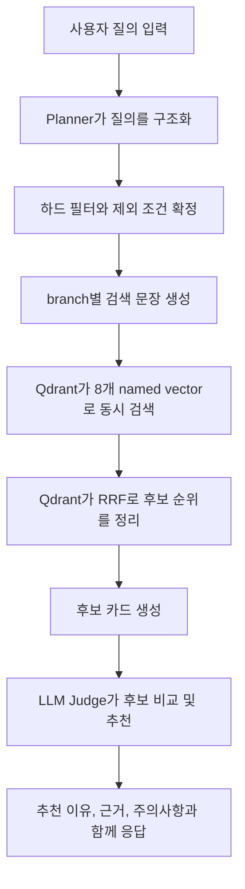

# 서비스 동작 설명서

이 문서는 평가위원 추천 서비스가 실제로 어떻게 동작하는지 설명하기 위한 문서다.

핵심 한 줄 요약은 아래와 같다.

> Qdrant는 후보를 폭넓게 찾고, LLM은 그 후보들을 비교해 최종 추천한다.

## 1. 사용자 질의가 들어오면 무슨 일이 일어나는가

예를 들어 사용자가 아래처럼 질문한다고 가정한다.

> "AI 반도체 분야에서 최근 5년 논문과 과제 실적이 좋은 평가위원을 추천해줘. 특정 기관은 제외해줘."

이때 시스템 안에서는 아래 순서로 일이 진행된다.

### 1-1. 질의를 이해하는 단계

먼저 Planner가 사용자의 문장을 읽고, 아래처럼 검색에 필요한 정보를 구조화한다.

- 사용자가 찾는 주제는 무엇인지
- 반드시 지켜야 하는 조건이 무엇인지
- 제외해야 하는 기관이 있는지
- 논문, 특허, 과제 중 어떤 근거를 더 중요하게 읽어야 하는지

여기서 중요한 점은, Planner가 검색 범위를 마음대로 끄고 켜지 않는다는 것이다.

이 서비스는 `basic`, `art`, `pat`, `pjt`를 항상 모두 검색한다. 대신 Planner는 branch별 검색 문장을 더 잘 만들기 위한 힌트만 준다.

### 1-2. 하드 필터를 먼저 확정하는 단계

추천 서비스에서는 "좋아 보이는 사람"보다 "조건을 만족하는 사람"이 먼저다.

그래서 아래 조건들은 LLM의 감이 아니라 시스템 규칙으로 먼저 처리한다.

- 특정 기관 제외
- 특정 학위 이상
- 최근 N년 논문 보유
- SCIE 논문 여부
- 특허 출원/등록 여부
- 과제 수행 기간 조건

즉, 조건을 어기는 후보는 애초에 검색 후보 단계에서 걸러낸다.

### 1-3. 검색용 문장을 4가지 관점으로 다시 만드는 단계

같은 질문이라도 보는 관점이 다르면 검색 문장도 달라져야 한다.

그래서 시스템은 한 번의 사용자 질문을 4개의 관점으로 다시 정리한다.

- `basic`: 전공, 학위, 소속유형, 직위, 기술분류 관점
- `art`: 논문 제목, 키워드, 초록, 최근 연구성과 관점
- `pat`: 특허명, 출원/등록, 사업화 관련 관점
- `pjt`: 과제명, 연구목표, 연구내용, 전문기관 관점

이렇게 만드는 이유는, 같은 사람이라도 어느 근거에서 강점이 드러나는지가 다르기 때문이다.

### 1-4. Qdrant가 후보를 찾는 단계

이제 Qdrant가 실제 검색을 수행한다.

한 명의 전문가는 Qdrant 안에서 하나의 point로 저장되어 있다. 대신 그 point 안에 여러 종류의 벡터가 함께 들어 있다.

- `basic_vector_e5i`
- `art_vector_e5i`
- `pat_vector_e5i`
- `pjt_vector_e5i`
- `basic_vector_bm25`
- `art_vector_bm25`
- `pat_vector_bm25`
- `pjt_vector_bm25`

즉, 한 사람을 한 번만 저장하되, 그 사람을 찾는 시각은 여러 개를 동시에 갖고 있는 구조다.

### 1-5. 후보 카드로 압축하는 단계

Qdrant가 후보를 찾고 나면, 시스템은 그 후보들을 그대로 LLM에 넘기지 않는다.

대신 "후보 카드"라는 요약 형태로 압축한다.

후보 카드에는 보통 아래 정보가 들어간다.

- 기본 프로필
- 논문/특허/과제 개수
- 대표 논문 1~2건
- 대표 특허 1건
- 대표 과제 1~2건
- 어떤 branch에서 근거가 잡혔는지
- 부족한 근거가 무엇인지

이 단계가 필요한 이유는, LLM이 판단해야 할 핵심 근거만 선별해서 보여줘야 비교 품질이 좋아지기 때문이다.

### 1-6. LLM이 최종 추천을 만드는 단계

마지막으로 LLM Judge가 후보 카드를 비교한다.

이때 LLM의 역할은 새로운 후보를 만들어내는 것이 아니다. 이미 Qdrant가 찾아온 후보들 중에서:

- 누가 더 적합한지
- 왜 그렇게 판단하는지
- 어떤 근거가 강한지
- 어떤 위험이나 부족 정보가 있는지

를 비교 설명하는 역할을 맡는다.

그래서 최종 응답에는 보통 아래가 함께 나온다.

- 추천 순위
- 추천 이유
- 대표 근거
- 주의사항
- 부족 정보

## 2. 검색할 때 named vector는 어떻게 동작하는가

이 서비스는 한 사람을 여러 각도에서 보기 위해 named vector를 사용한다.

쉽게 말하면, 한 전문가에 대해 아래 4개의 "검색 창"을 따로 두는 것과 비슷하다.

| branch | 무엇을 보는가 | dense vector 역할 | sparse vector 역할 |
| --- | --- | --- | --- |
| `basic` | 전공, 학위, 소속, 직위, 기술분류 | 의미적으로 비슷한 프로필을 찾음 | 정확한 키워드나 용어 일치를 찾음 |
| `art` | 논문 성과 | 주제가 비슷한 논문 실적을 찾음 | 논문 제목, 키워드, 용어 일치를 찾음 |
| `pat` | 특허와 사업화 | 의미가 비슷한 특허/사업화 경험을 찾음 | 발명명, 등록유형, 핵심 용어를 찾음 |
| `pjt` | 과제 수행 경험 | 비슷한 연구과제 경험을 찾음 | 과제명, 기관명, 목표 문구 일치를 찾음 |

여기서 `dense`와 `sparse`의 차이는 아래처럼 이해하면 쉽다.

- dense 검색: 말이 조금 달라도 의미가 비슷하면 찾아준다
- sparse 검색: 핵심 단어가 실제로 들어 있는지를 잘 찾아준다

예를 들어 사용자가 "AI 반도체"라고 검색했는데 데이터에는 "인공지능 기반 반도체 설계"라고 적혀 있다면:

- dense는 의미가 비슷하다고 판단해 잘 찾을 수 있다
- sparse는 `AI`, `반도체` 같은 단어가 실제로 있는지를 강하게 본다

그래서 둘 중 하나만 쓰기보다 둘을 함께 쓰는 것이 안전하다.

## 3. 검색 과정에서 Qdrant의 역할은 어디까지인가

이 서비스에서 Qdrant의 역할은 매우 크지만, "최종 추천 판단자"는 아니다.

정리하면 아래와 같다.

### Qdrant가 담당하는 일

- 8개의 named vector를 이용한 동시 검색
- 하드 필터 적용
- dense와 sparse 결과의 결합
- 논문/특허/과제/기본정보 branch 결과의 결합
- 후보군 상위 N명 추출

### LLM이 담당하는 일

- 후보 간 적합도 비교
- 근거 설명
- 부족 정보 표시
- 최종 추천 순위 정리

즉, Qdrant는 "누가 후보가 될 수 있는가"를 정리하고, LLM은 "그 후보들 중 누가 더 적합한가"를 설명한다.

## 4. 이 서비스에 별도 리랭커가 있는가

현재 설계에는 일반적으로 말하는 별도 cross-encoder 리랭커는 없다.

대신 순서를 다시 정리하는 과정이 두 번 있다.

### 4-1. Qdrant 내부 재정렬

Qdrant는 각 검색 결과를 그대로 두지 않고 `RRF` 방식으로 다시 합친다.

이 단계는 넓은 의미의 재정렬이다.

- 먼저 branch 내부에서 `dense + sparse`를 합친다
- 그다음 `basic + art + pat + pjt`를 다시 합친다

즉, Qdrant는 검색 결과를 정리하고 후보 순위를 안정화하는 역할을 한다.

### 4-2. LLM 비교 판단

그 다음 단계에서 LLM이 후보 카드를 읽고 추천 순위를 정리한다.

이 단계는 검색 엔진 재정렬이라기보다, 추천 판단과 설명 생성에 가깝다.

따라서 현재 구조는 아래처럼 이해하는 것이 가장 정확하다.

- Qdrant: 검색 기반 순위 정리
- LLM: 후보 비교 기반 최종 추천

## 5. 하이브리드 검색 점수는 어떻게 만들어지는가

이 부분은 가장 많이 오해되는 지점이다.

이 서비스는 단순히 "논문 30점 + 특허 20점 + 과제 40점"처럼 가중치를 더하는 구조가 아니다.

현재는 `equal-weight RRF`를 사용한다.

### 5-1. branch 내부 점수

예를 들어 `art` branch에서는 아래 두 검색이 동시에 일어난다.

- `art_vector_e5i`로 dense 검색
- `art_vector_bm25`로 sparse 검색

이 둘은 각자 자신만의 방식으로 점수를 계산한다.

- dense는 의미 유사도를 바탕으로 점수를 만든다
- sparse는 단어 일치 정도를 바탕으로 점수를 만든다

그런데 두 점수 체계는 성격이 다르다. 그래서 raw score를 단순 평균내지 않는다.

대신 "각 검색에서 몇 등으로 올라왔는가"를 기준으로 `RRF`로 합친다.

쉽게 말하면:

- dense에서 상위권
- sparse에서도 상위권

이면 그 후보는 branch 내부에서 더 안정적으로 올라간다.

### 5-2. branch 간 점수

그 다음에는 `basic`, `art`, `pat`, `pjt` 각 branch 결과를 다시 `RRF`로 합친다.

여기서 중요한 의미는 아래와 같다.

- 한 branch에서만 매우 강한 후보도 올라올 수 있다
- 여러 branch에서 골고루 상위권인 후보는 더 안정적으로 올라온다

즉, 최종 상위 후보는 "한 가지 근거만 강한 사람"보다 "여러 근거에서 반복적으로 좋은 사람"이 유리해지는 구조다.

### 5-3. 점수를 숫자 하나로 너무 단순하게 보면 안 되는 이유

최종 점수는 "몇 점짜리 전문가"를 뜻하지 않는다.

이 점수는 더 정확히 말하면:

> 여러 검색 결과에서 이 사람이 얼마나 반복적으로 상위권에 등장했는가

를 요약한 값에 가깝다.

그래서 운영 설명 시에는 raw score 숫자보다 아래를 함께 보는 것이 더 중요하다.

- 어떤 branch에서 근거가 잡혔는가
- 대표 논문/특허/과제가 무엇인가
- 하드 필터를 모두 만족했는가
- 부족한 근거가 있는가

## 6. 예시로 보면 어떻게 이해하면 되는가

같은 질의에 대해 아래 3명의 후보가 있다고 가정해보자.

### 후보 A

- 논문 근거 강함
- 과제 근거도 있음
- 기본 프로필도 주제와 잘 맞음
- 특허는 약함

### 후보 B

- 특허는 매우 강함
- 과제는 보통
- 논문 근거는 약함

### 후보 C

- 논문은 강하지만 최근성이 떨어짐
- 과제 경험이 부족함

이때 Qdrant는 보통 아래처럼 판단에 필요한 순서를 만든다.

- A: 여러 branch에서 상위권
- B: 특허 branch에서는 강함
- C: 일부 branch에서는 보이지만 필터와 최근성에서 약함

그 다음 LLM은 이렇게 정리한다.

- A를 1순위 추천
  - 이유: 논문과 과제 근거가 함께 있고 주제 적합도가 높음
- B를 2순위 추천
  - 이유: 특허 쪽 강점은 분명하지만 논문 근거는 상대적으로 약함
- C는 제외 또는 하위 배치
  - 이유: 최근성 또는 근거 다양성이 부족함

즉, Qdrant는 "누가 경쟁자 후보인가"를 정리하고, LLM은 "왜 이 순서로 추천하는가"를 말해준다.

## 7. 서비스 품질은 무엇에 가장 크게 좌우되는가

이 서비스 품질은 모델 하나보다 데이터 계약의 영향을 더 많이 받는다.

특히 아래가 중요하다.

- `art[]`, `pat[]`, `pjt[]` payload가 빠지지 않았는지
- 날짜 필드가 올바르게 들어갔는지
- 기관명 exact 필드가 정규화되었는지
- 각 named vector에 들어갈 source text가 목적에 맞게 만들어졌는지

즉, 데이터가 비어 있거나 잘못 들어가면 검색 품질도 바로 흔들린다.

## 8. 마지막으로 기억하면 좋은 핵심

이 서비스는 "벡터 검색만으로 추천을 끝내는 시스템"이 아니다.

아래 두 단계가 함께 있어야 제대로 동작한다.

1. Qdrant가 여러 근거를 바탕으로 후보를 넓고 안정적으로 찾는다.
2. LLM이 그 후보들을 비교해 최종 추천 이유를 설명한다.

그래서 추천 결과를 볼 때는 순위 숫자 하나보다 아래를 같이 보는 것이 중요하다.

- 어떤 근거로 추천되었는지
- 어떤 근거가 부족한지
- 어떤 필터가 적용되었는지
- 어떤 branch에서 반복적으로 상위에 올랐는지

## 9. 시스템 가시성 및 추적성(Traceability)

본 시스템은 복잡한 AI 추론 과정을 운영자가 명확히 파악할 수 있도록 강력한 추적 기능을 제공한다.

### 9-1. Trace ID (Request ID) 기반 추적
- 모든 API 요청이 인입되는 시점에 고유한 **Trace ID**가 생성된다.
- 이 ID는 비동기 컨텍스트(`ContextVar`)를 통해 파이프라인 전체(Planner -> Retriever -> Judge)에 전달된다.
*   **로그 예시**: `[2024-04-06 14:00:00] [INFO] [ID:550e8400-e29b...] [Planner] LLM 질의 분석 시작`

### 9-2. 단계별 주요 로깅 포인트
- **Planner**: 사용자 의도 분석 결과, 적용된 하드 필터 목록, 생성된 브랜치별 쿼리 힌트.
- **Retriever**: Qdrant 검색 통계(검색된 후보 수), 하이브리드 검색 실행 정보.
- **Judge**: 최종 후보 카드 요약, 추천 순위 결정 근거, Fallback 로직 작동 여부.

### 9-3. 실시간 모니터링 (UI Console)
- `/playground` UI 하단의 **실시간 로그 콘솔**을 통해 서버 내부의 모든 한글 로그를 즉시 확인할 수 있다.
- 이를 통해 AI의 판단 근거를 블랙박스가 아닌 투명한 과정으로 이해하고 디버깅할 수 있다.
