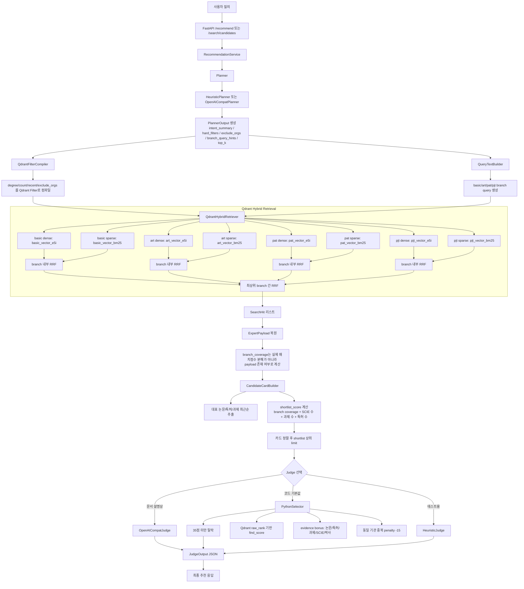
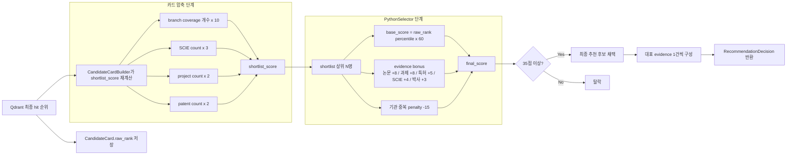

# 코드 기준 보강 다이어그램

## 1) 실제 구현 기준 전체 흐름

## 2) 실제 점수/선발 흐름

## 3) 코드 기준으로 반드시 고쳐야 할 설명 문구

- 현재 구현은 **Qdrant Multi-vector**가 아니라 **Qdrant Named Vector + Sparse Vector** 구조다.
- 현재 구현은 **Weighted Prefetch / Weighted RRF**를 사용하지 않는다.
- branch 중요도는 가중치로 주는 것이 아니라 **branch_query_hints 텍스트 보정**으로만 반영한다.
- branch별 매치 근거를 정교하게 추적하지 않고, `branch_coverage`는 현재 **payload 존재 여부**로만 계산한다.
- 최종 판정은 문서 표현과 달리 항상 Judge LLM이 아니다. 설정에 따라 **PythonSelector**가 기본 경로가 될 수 있다.
- 현재 shortlist 단계는 Qdrant score를 그대로 쓰지 않고, **counts 기반 재정렬**을 한 번 더 수행한다.

## 4) 코드 점검 중 발견된 즉시 수정 필요 항목

1. `RecommendationService.search_candidates()`는 `card_builder.build_small_cards(...)`를 호출하지만, 현재 `CandidateCardBuilder`에는 해당 메서드가 없다.
2. `Settings` 기본값은 `llm_backend=python_selector`인데, `strict_runtime_validation=True` 기본값은 `openai_compat`만 허용한다.
3. `HeuristicJudge`는 현재 도메인 모델과 맞지 않는 레거시 필드명(`paper_nm`, `jrnl_pub_dt`, `ipr_invention_nm` 등)을 참조한다.
4. `/recommend` 빈 결과를 200 + 빈 배열로 준다는 문서와 달리, 실제 서비스 코드는 추천 결과가 비면 예외를 발생시킨다.
5. `/health/ready` 실패 시 응답이 top-level body로 반환된다는 문서와 달리, 현재 코드는 `HTTPException(detail=...)` 경로를 사용한다.
