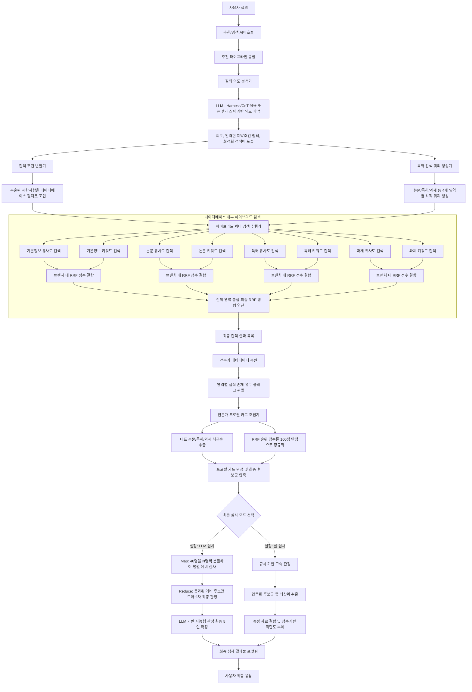

# 코드 기준 보강 다이어그램

## 1) 실제 구현 기준 전체 흐름



## 2) 실제 점수/선발 흐름

```mermaid
graph LR
    A[데이터베이스 검색 결과] --> B[최고 점수 기준 100점 만점 정규화]
    B --> C[정규화 순위 점수를 최종 숏리스트 추천 점수로 확정]

    subgraph S1[프로필 카드 구성 단계]
        C --> C1[키워드 기반 주요 실적건 선별]
        C --> C2[데이터 존재 여부 확인]
        C1 --> C3[실적 데이터가 포함된 종합 카드 조립]
        C2 --> C3
    end

    C3 --> D[점수 내림차순 정렬 후 최상위 소수 인원 확정]

    subgraph S2[규칙 기반 심사 경로]
        D --> E[최상위 인원 차례로 순회]
        E --> F[기준 점수 구간별 적합도 텍스트 지정<br>높음 / 중간 / 보통]
        E --> G[확인된 데이터 토대로 추천 증빙 자동 맵핑]
        F --> H[심사 완료 항목 반환]
        G --> H
    end

    subgraph S3[LLM 심사 경로 - Map-Reduce 병렬 처리]
        D --> I[전체 후보 40명을 N명(예: 10명) 단위 청크로 분할]
        I --> J_MAP[각 청크별 LLM 비동기 병렬 호출로 예비 우수자 도출 - Map]
        J_MAP --> J_RED[도출된 예비 우수자들만 모아 2차 LLM 최종 심사 - Reduce]
        J_RED --> K[응답 데이터 JSON 교정 및 최종 선발 항목 반환]
    end

    H --> M{최종 결과 병합}
    K --> M
    M --> RESP[최종 결과물 앱 클라이언트 전송]
```

## 3) 💡 시스템 주요 역할 및 용어 설명
다이어그램의 이해를 돕기 위해 기존 주요 클래스(영어 명칭)와 한글 블록을 매핑한 설명입니다.

| 한글 블록 명칭 | 매핑된 실제 소스코드 개념 | 역할에 대한 상세 설명 |
|---|---|---|
| **`추천 파이프라인 총괄`** | `RecommendationService` | 시스템의 심장부입니다. 질의 분석, 데이터 검색, 알고리즘 심사를 아울러 최종 결과까지 조립하는 총지휘자 역할을 하며, **Map-Reduce 병렬 호출 트래픽 관장**도 여기서 수행합니다. |
| **`질의 의도 분석기`** | `Planner` | 사용자가 입력한 자연어에서 필수 조건, 중요 키워드, 피해야 할 기관 정보 등을 기계가 이해할 수 있는 상태로 뽑아냅니다. **Harness 기법 및 CoT(생각의 사슬)**이 적용되어 환각 없이 엄격한 필터 값을 도출합니다. |
| **`검색 조건 변환기`** | `QdrantFilterCompiler` | 파악된 조건을 벡터 데이터베이스(Qdrant)가 읽을 수 있는 전용 필터 구문으로 번역해 줍니다. |
| **`특화 검색 쿼리 생성기`** | `QueryTextBuilder` | 논문, 과제, 기본 정보 등 특징이 다른 세부 데이터 더미(브랜치)들에 꼭 맞는 최적화된 검색어를 생성합니다. |
| **`하이브리드 벡터 검색 수행기`** | `QdrantHybridRetriever` | 의미 기반(Dense) 검색과 정확한 키워드(Sparse BM25) 매칭을 동시에 수행하고 순위 융합(RRF) 알고리즘을 사용해 최상급 성적의 데이터들을 선별합니다. |
| **`전문가 프로필 카드 조립기`** | `CandidateCardBuilder` | 방대하고 복잡한 데이터 조각들을 사람 눈에 보기 좋은 '하나의 전문가 카드 객체'로 깔끔하게 조립해 제공합니다. |
| **`지능형 판정 / 고속 판정`** | `Judge` | 모든 증빙과 평가를 취합해 최종 인터뷰(심사)를 진행합니다. LLM을 이용해 **Map-Reduce 병렬 심사**로 심도깊게 리뷰하거나, 빠른 규칙(Rule) 기반으로 통과자를 결정합니다. |